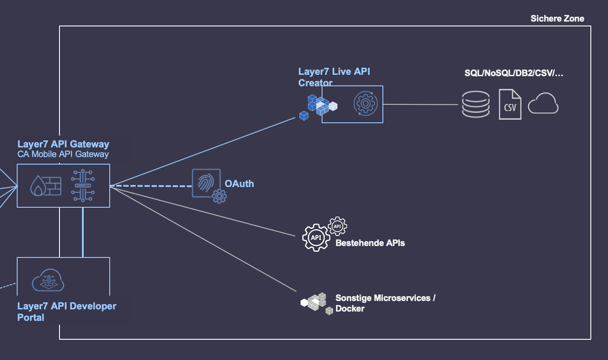
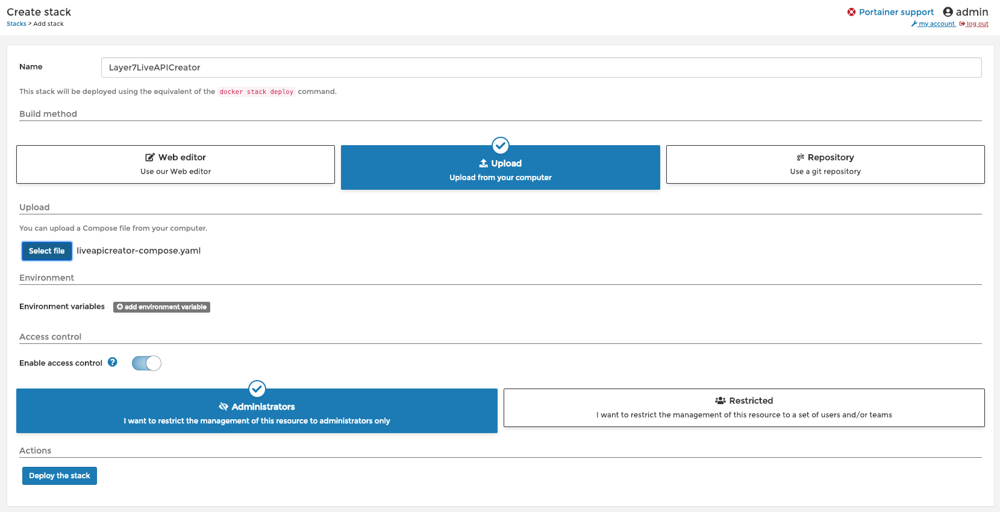
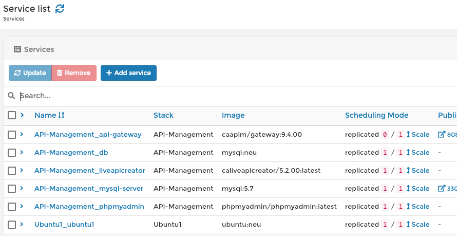
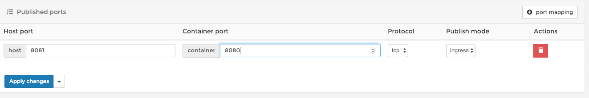

# Layer7 API Management als Docker-Swarm Service
[Layer7 Live API Creator](https://www.ca.com/de/products/ca-live-api-creator.html) ist eine Lösung von CA Technolgies a Broadcom Company zur "On the Fly" Erzeugung von HTTP/RestFul Schnittstellen auf Basis von Datenquellen. Beispielsweise SQL/NoSQL Datenbanken, CSV Dateien u.v.m..

[Layer7 API Gateway](https://www.ca.com/us/products/apim/gateway.html)
Transformieren Sie bestehende Systeme, verbinden Sie Systeme und wenden Sie konsistente Sicherheit und Governance auf Ihre APIs an. Layer7 API Gateway (ehemals CA API Gateway) ist ein erweiterbares, skalierbares, leistungsstarkes Gateway zur Verbindung Ihrer wichtigsten Daten und Anwendungen über eine beliebige Kombination von Cloud-, Container- oder lokalen Umgebungen.

In diesem Use Case wird die Anwendung des Use-Case 3 wieder aufgenommen und in Kombination mit Docker-Swarm eine vollständige API-Management-Umgebung aufgebaut.

## Use Case 4: Layer7 API Management als Docker-Swarm Service.
Für unseren Use-Case wollen wir Docker-Swarm verwenden, um eine reproduzierbare Umgebung zu erzeugen und diese Basis auch für andere Anwendungsfälle nutzen zu können.
Zur Realisierung benötigen wir die folgenden Docker-Images.

* [Portainer](https://hub.docker.com/r/portainer/portainer), eine leichtgewichte Oberfläche zum Management von Docker-Swarm
* [MySql Datenbank](https://hub.docker.com/_/mysql) als Datenquelle für die Erzeugung eines oder mehrerer APIs
* [PhpMyAdmin](https://hub.docker.com/r/phpmyadmin/phpmyadmin/) für die angenehmere Verwaltung der MySql-Datenbank
* [Layer7 Live API Creator](https://hub.docker.com/r/caliveapicreator/5.2.00)
* [Layer7 API Gateway](https://hub.docker.com/r/caapim/gateway)

Es soll folgende Konstellation implementiert werden:


Hierzu erzeugen wir ein *backend* Netzwerk, mit dem wir sowohl das API Gateway als auch den Live API Creator verbinden:

```
docker network create --driver=overlay backend_internal
```

Dieses Netzwerk repräsentiert die rechte Seite des API Gateways, in der die Anwendungen Layer7 Live API Creator, PHPMyAdmin, MySql (2 mal) enthalten sein werden.


### Allgemeine Vorbereitungen 
Um diesen Use Case durchzuführen, benötigen wir natürlich eine Installation von Docker.
Hierzu wird die Variante [**Docker CE**](https://docs.docker.com/install/) für das zur Verfügung stehende Betriebssystem installiert. 
Sollte die Installation auf der zur Verfügung stehenden Maschine so nicht möglich sein, gibt es natürlich auch immer die Möglichkeit in einer Virtualisierungsumgebung z.B: VMWare Workstation oder [VirtualBox](https://www.virtualbox.org/) zu arbeiten.

#### Vorbereitungen für Docker-Swarm
Desweiteren soll Docker-Swarm verwendet werden, hierzu installieren wir in eine bestehende Docker-Umgebung den Portainer und nutzen den [Quick Start](https://portainer.readthedocs.io/en/latest/deployment.html) zur Aktivierung.

```
docker pull portainer/portainer
docker volume create portainer_data
docker run -d -p 9000:9000 --name portainer --restart always -v /var/run/docker.sock:/var/run/docker.sock -v portainer_data:/data portainer/portainer
docker swarm init
```

Jetzt kann die Oberfläche von Portainer [aufgerufen werden](http://localhost:9000) aufgerufen werden. Beim erstmaligen Anmelden muss ein administrativer Benutzer angelegt werden. Ich verwende "admin" als Benutzer und "dockerfun" als Passwort.
Danach wählen wir das lokale Docker-Environment aus.

Im Dashboard unter den Stacks sehen wir bereits unsere layer7apicreator-compose Implementierung. Allerdings ist die Kontrolle noch "limited", da wir diesen Stack nicht mittels Docker-Swarm sondern über docker-compose implementiert haben.
Wir löschen unsere bisherige Implementierung mit:

```
docker-compose down --volume
```

(Anmerkung: Wir befinden uns im Verzeichnis, in der das "docker-compose" File liegt.)

#### Vorbereitungen für Layer7 Live API Creator
Wir nutzen das bereits vorbereitete docker-compose File um den "Stack" des Live API Creators neu aufzubauen.

Für die Implementierung gemäß dem obigen Schaubild entfernen wir die Portfreigaben und löschen die Angaben für den Build-Prozess, da diese so von Docker-Swarm nicht unterstützt werden. Wir geben direkt das im Use-Case 3 gebaute Image *mysql:neu* an.

Das Netzwerk *liveapi* verändern wir in *backend*. Die Änderungen sind unten im Compose-File nachzuvollziehen.


#### Vorbereitungen für Layer7 API Gateway
Für das Layer7 API Gateway wird eine Lizenz benötigt. Diese wird an API-Gateway Kunden über den Support-Kanal ausgeliefert.
Desweiteren wird der Policy Manager zur Verwaltung des Gateways benutzt. Dieser ist für API-Gateway Kunden im Download-Portal des Supports verfügbar. Aktuell ist es der Download: *CA API Gateway Policy Manager 9.4.00: GEN500000000002088*.

### Vorbereitungen für den API Management Service

Wir wollen in diesem Beispiel mehrere Container in einnen Docker-Swarm Service integrieren.

Um die Daten gesammelt an einer Stelle vorzuhalten legen wir im Home-Verzeichnis ein Unterverzeichnis an. Ich wähle das Verzeichnis ~/Docker_Runtime/APIGateway/gw94 mit folgender Struktur.

```
Manager-9.4.00      # enthält den API Gateway Policy Manager. Insbesondere manager.jar und die Libraries (lib Unterverzeichnis)
docker-compose.yaml # enthält unser docker-compose File
license.xml         # enthält die Gateway Lizenz (.lic File in .zip umbenennen und eine dort enthaltene Lizenz als license.xml ablegen
mysql-volume        # Docker Volume für die persistente Speicherung der MySql Datenbank
```

In der folgenden Compose-Datei sind die Einträge vom bisherigen Live API Creator für das API Gateway und eine weitere MySQL Datenbank für das API Gateway ergänzt.

Die Basis hierfür findet sich in der [Dokumentation](https://docops.ca.com/ca-api-gateway/9-4/en/other-gateway-form-factors/using-the-container-gateway/getting-started-with-the-container-gateway/run-the-container-gateway-on-docker-engine/sample-docker-compose-deployment-file) zum [API Gateway in Docker](https://docops.ca.com/ca-api-gateway/9-4/en/other-gateway-form-factors/using-the-container-gateway/getting-started-with-the-container-gateway/run-the-container-gateway-on-docker-engine). 

Da unsere Docker-Installation jetzt im *Swarm Mode* läuft, unterscheiden sich ein paar Einträge bezüglich der Ressourcen gegenüber den *Docker Compose* Einträgen.

```
version: '3'
services:
  api-gateway:
    restart: always
    depends_on:
      - mysql-server
    image: caapim/gateway:9.4.00
    deploy:
      resources:
        limits:
          cpus: "4"
          memory: "6G"
    ports:
      - "8080:8080"
      - "8443:8443"
      - "9443:9443"
    volumes:
      - /opt/SecureSpan/Gateway/node/default/etc/bootstrap/services/restman
      - /Users/grean11/Docker_Runtime/APIGateway/gw94/license.xml:/opt/SecureSpan/Gateway/node/default/etc/bootstrap/license/license.xml
    networks:
      - frontend
      - backend
    environment:
      ACCEPT_LICENSE: "true"
      SSG_ADMIN_USERNAME: "admin"
      SSG_ADMIN_PASSWORD: "7layer"
      SSG_DATABASE_JDBC_URL: "jdbc:mysql://mysql-server:3306/ssg"
      SSG_DATABASE_USER: "root"
      SSG_DATABASE_PASSWORD: "password"
      SSG_CLUSTER_HOST: "gateway.ca.com"
      SSG_CLUSTER_PASSWORD: "clusterpassword"
      SSG_JVM_HEAP: "4g"
      EXTRA_JAVA_ARGS: "-XX:ParallelGCThreads=4 -Dcom.l7tech.bootstrap.autoTrustSslKey=trustAnchor,TrustedFor.SSL,TrustedFor.SAML_ISSUER"

  mysql-server:
    image: mysql:5.7
    restart: always
    ports:
      - "3306:3306"
    deploy:
      resources:
        limits:
          memory: "512M"
    environment:
      - MYSQL_ROOT_PASSWORD=password
      - MYSQL_DATABASE=ssg
    volumes:
      - /Users/grean11/Docker_Runtime/APIGateway/gw94/mysql-volume:/var/lib/mysql
    networks:
      - backend
    command:
      - "--character-set-server=utf8"
      - "--innodb_log_buffer_size=32M"
      - "--innodb_log_file_size=80M"
      - "--max_allowed_packet=8M"

  # Database
  db:
    image: mysql:neu
    volumes:
      - db_data:/var/lib/mysql
    restart: always
    environment:
      MYSQL_ROOT_PASSWORD: mysqlfun
      MYSQL_DATABASE: andreas
      MYSQL_USER: andreas
      MYSQL_PASSWORD: mysqlfun
    networks:
      - backend

  # phpmyadmin
  phpmyadmin:
    depends_on:
      - db
    image: phpmyadmin/phpmyadmin
    restart: always
    environment:
      PMA_HOST: db
      MYSQL_ROOT_PASSWORD: mysqlfun
    networks:
      - backend

  # Layer7 Live Api Creator
  liveapicreator:
    depends_on:
      - db
    image: caliveapicreator/5.2.00
    restart: always
    networks:
      - backend

networks:
  frontend:
  backend:
    external:
      name: backend_internal

volumes:
  db_data:
    external:
      name: mysqldb
```

In der Oberfläche des Portainers unter *Stacks/+ Add stack* laden wir unsere neue Definition und "deployen" den Stack.


Im Portainer unter *Services* sehen wir folgende 

Ubuntu1_ubuntu ist ein Container mit Ubuntu, der ebenfalls im Backend-Netzwerk eingebunden ist um dort weitere Analyse und Testmöglichkeiten zu implementieren ohne die bestehenden Container unseres API Management Konstrukts verändern zu müssen.

```
version: '3'

services:
  # ubuntu
  ubuntu1:
    image: ubuntu:neu
    command: tail -f /var/log/lastlog
    environment:
      PMA_HOST: db
      MYSQL_ROOT_PASSWORD: mysqlfun
    networks:
      backend:
        aliases:
          - linux1 
networks:
  backend:
    external:
      name: backend_internal
```

Der Container wurde erzeugt, indem im laufenden *ubuntu:latest* z.B.: die Netzwerk Tools und Ping Utility sowie curl per *apt-get* nachinstalliert wurden und anschliessend mit dem Befehl ```docker commit <containerID> ubuntu:neu``` ein modifiziertes Image *ubuntu:neu* erzeugt wurde.

Nach der Auswahl eines spezifischen Service lassen sich verschiedene Parameter dynamisch verändern, so lassen sich  oder Umgebungsvariablen ändern.

### Stoppen, Starten des Service
Um den Service zeitweise zu stoppen und zu einem anderen Zeitpunkt wiederzuverwenden können die Menupunkte im Portainer genutzt werden. 