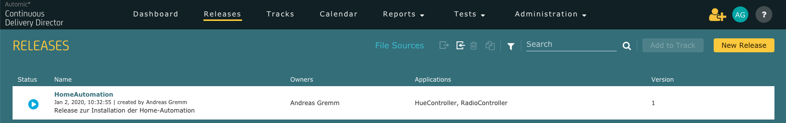
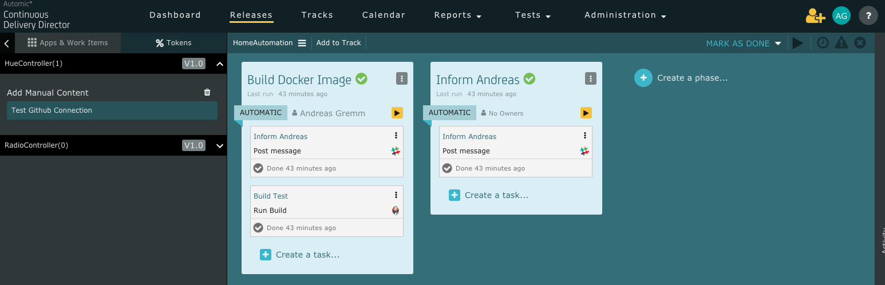
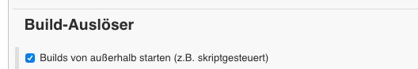

# Automic Continuous Delivery Director
Automic Continuous Delivery Director ist ein Bestandteil der [Digital BizOps Starter Edition](https://www.broadcom.com/info/enterprise/starter-edition-software) und ist für KMU's oder auch Enterprise Unternehmen bis zu einem bestimmten Nutzungsgrad kostenlos.

Der Start mit der SaaS Lösung ist recht einfach, ein [Einstieg](https://techdocs.broadcom.com/content/broadcom/techdocs/us/en/ca-enterprise-software/intelligent-automation/automic-continuous-delivery-director-saas/1-0/getting-started-saas.html) ist schnell erledigt.

## CDDirector
- Endpunkte konfigurieren
- Anwendungen mit Ihren Versionen definieren
- Ein Release erzeugen und die Anwendungen hinzufügen

- zu dem Release die Phasen und Tasks hinzufügen


Das dargestellte Beispiel besteht aus zwei Phasen welche durch ein Commit/Push in Github automatisch ablaufen sollen. Die erste Task in jeder Phase ist eine Benachrichtigung über einen Slacker-Endpunkt. Die zweite Task in der ersten Phase startet ein Build mittels Jenkins in einer Docker-Installation.

In der Datei **HomeAutomation_1.json** befindet sich ein Export meines Beispiel-Releases.


## Jenkins in Docker
Ich nutze Jenkins in einer Docker-Installation auf dem lokalen Rechner, der natürlich per Port-Freischaltung/Weiterleitung im Router aus dem Internet erreichbar sein muss.

Der Jenkins-Container wird gemäß [Beschreibung](https://hub.docker.com/_/jenkins) installiert und konfiguriert. Für die Nutzung mit Docker ist allerdings die [jenkinsci/blueocean](https://hub.docker.com/r/jenkinsci/blueocean/) Variante besser, da diese bereits den Docker-Client installiert hat. 

Um die Persistenz sicherzustellen, nutze ich ein Docker-Volume ***jenkins_home***.

```
docker run \
  -u root \
  -d \
  -p 8080:8080 \
  -v jenkins_home:/var/jenkins_home \
  -v /var/run/docker.sock:/var/run/docker.sock \
  --name jenkinsocean \
  jenkinsci/blueocean
```
Innerhalb von Jenkins habe ich ein **Freestyle Software Projekt** Element angelegt und die Parameter für die Tabs ***Source-Code-Management*** mit meinem genutzten Github Repository (Branch nicht vergessen!) und ***Build-Auslöser*** konfiguriert.

Das Build-Verfahren ist simple eine Shell mit dem Befehl **ls -ali**, da ja nur der Flow gezeigt werden soll und dieser für die Demonstration möglichst schnell und einfach durchlaufen soll.

## GitHub Integration Controller


Der [Start einer Phase mittels git-hub-integration-controller](https://techdocs.broadcom.com/content/broadcom/techdocs/us/en/ca-enterprise-software/intelligent-automation/automic-continuous-delivery-director-saas/1-0/getting-started-saas/tutorial-create-a-release/set-up-a-release.html#concept.dita_a1b675ea3f886137726d0dbe6c3f1151cd370d4b_IntegratewithGitHub) ermöglicht die Integration von GitHub und CDD bei einem Push in das Repository.  

Der bei mir in GitHub eingestellte Webhook sieht folgendermaßen aus: 

**https://cddirector.io/cdd/design/<my CDD tenant>/v1/applications/HueController/application-versions/V1.0?username=<my cdd email>&branchName=<my branch, default=master>**

Geändert für Stephanie