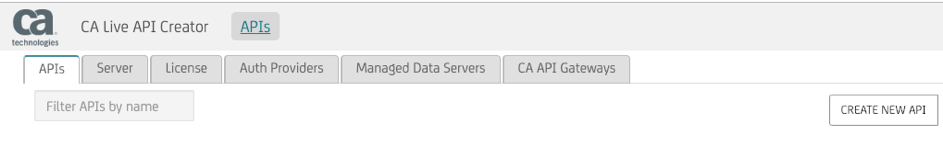
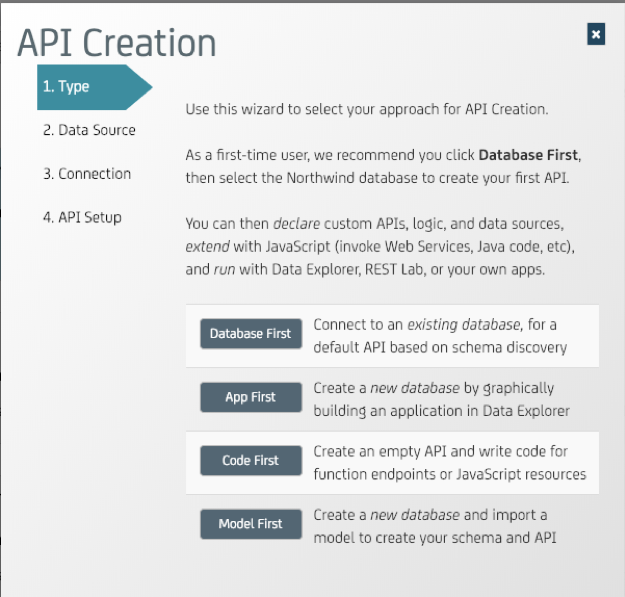
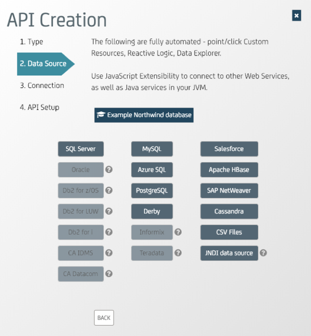
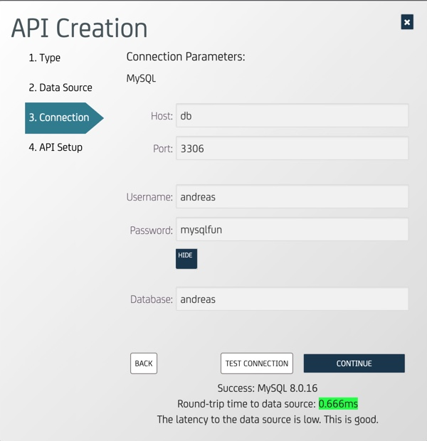
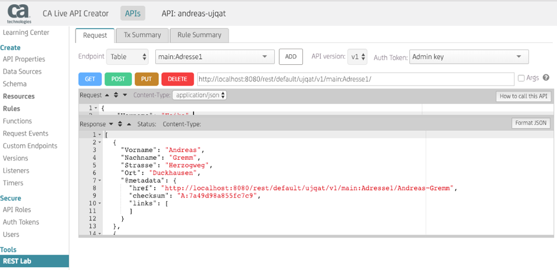

# Layer7 Live API Creator als Service
[Layer7 Live API Creator](https://www.ca.com/de/products/ca-live-api-creator.html) ist eine Lösung von CA Technolgies a Broadcom Company zur "On the Fly" Erzeugung von HTTP/RestFul Schnittstellen auf Basis von Datenquellen. Beispielsweise SQL/NoSQL Datenbanken, CSV Dateien u.v.m..

In diesem Use Case wird die Anwendung des Use-Case 1 wieder aufgenommen und in Kombination mit dem gelernten aus Use Case 2 neu konstruiert.

## Use Case 3: Layer7 Live API Creator - Service

Für unseren Use-Case wollen wir Docker verwenden, um eine reproduzierbare Umgebung zu erzeugen und diese Basis auch für andere Anwendungsfälle nutzen zu können.
Zur Realisierung benötigen wir die folgenden drei Docker-Images.

* [MySql Datenbank](https://hub.docker.com/_/mysql) als Datenquelle für die Erzeugung eines oder mehrerer APIs
* [PhpMyAdmin](https://hub.docker.com/r/phpmyadmin/phpmyadmin/) für die angenehmere Verwaltung der MySql-Datenbank
* [Layer7 Live API Creator](https://hub.docker.com/r/caliveapicreator/5.2.00)

In diesem Use-Case soll die Funktionlität von Docker dargestellt werden aus bestehenden Images neue Images zu erzeugen, in dem über eine Steuerdatei ([Dockerfile](https://docs.docker.com/engine/reference/builder/) mittels ```docker build -t <Tag> .``` die benötigten Veränderungen durchgeführt werden.

### Allgemeine Vorbereitungen 
Um diesen Use Case durchzuführen, benötigen wir natürlich eine Installation von Docker.
Hierzu wird die Variante [**Docker CE**](https://docs.docker.com/install/) für das zur Verfügung stehende Betriebssystem installiert. 
Sollte die Installation auf der zur Verfügung stehenden Maschine so nicht möglich sein, gibt es natürlich auch immer die Möglichkeit in einer Virtualisierungsumgebung z.B: VMWare Workstation oder [VirtualBox](https://www.virtualbox.org/) zu arbeiten.

### Vorbereitungen für die Datenbank
Um die Datenbank persistent vorzuhalten, nutze ich in diesem Beispiel das Docker Volume aus Use-Case 1, welches wieder mit eingebunden wird.

Das Volume wurde im Use-Case 1 mit folgenden Befehlen erzeugt und analysiert.

```
docker volume create mysqldb
docker volume ls
	DRIVER              VOLUME NAME
	local               mysqldb
docker inspect mysqldb
```
Im Use-Case 2 zu WordPress haben wir gelernt, dass ein neues Volume mit dem Präfix des Verzeichnisnamens erzeugt wurde. Später bei der Besprechung des docker-compose.yaml Files wird erklärt wie wir ein bereits bestehendes Volume einbinden können.

### Vorbereitungen für PhpMyAdmin und weitere Details

Mit MySql Version 8 wurde der Default-Authentifizierungsmechanismus geändert. Zum Zeitpunkt der Dokumentenerstellung war PhpMyAdmin damit noch nicht kompatibel.

Im Gegensatz zu Use-Case 1 verändern wir jetzt keine Dateien im laufenden my-mysql Container sondern bauen uns per Build ein neues Image welches die benötigte Änderung per Dockerfile eingebaut bekommt.

#### Definition des Dockerfile

Wir erzeugen uns ein neues Verzeichnis auf unserem Docker-Rechner und legen dort eine Datei **Dockerfile** mit folgendem Inhalt ab:

```
FROM mysql:latest
RUN echo "default_authentication_plugin=mysql_native_password" >>/etc/mysql/my.cnf
```
Mit den Zeilen im Dockerfile sagen wir dem späteren Build-Prozess, dass er als Basis das Image **mysql:latest** verwenden soll und dann mittels **echo** Befehl die my.cnf Datei ergänzen soll. Das gleiche Konstrukt hatten wir bereits im Use-Case 1 verwendet. In diesem Fall müssen wir die Authentifizierung des **root** Datenbankbenutzers nicht verändern, da dieser beim Starten des Containers erst angelegt wird. Er erhält damit automatisch die als Default gesetzte Authentifizierungsmethode.

Testweise kann der Build-Prozess einmal ausgeführt werden:

```
docker build -t mysql:temp .
docker image ls
```

#### Nutzen der persönlichen Datenbank aus Use-Case 1

Wir nutzen in diesem Beispiel die bereits bestehende Datenbank aus Use-Case 1, indem wir das bereits bestehende Volume **mysqldb** mit der bestehenden MySql-Datenbank einbinden.

### Definition des Layer7 Live API Creator Service

Als Basis für den Live API Creator Service verändern wir die WordPress Docker-Compose YAML Datei folgendermaßen:

```
version: '3'

services:
  # Database
  db:
    build:
      context: .
    image: mysql:neu
    volumes:
      - db_data:/var/lib/mysql
    restart: always
    environment:
      MYSQL_ROOT_PASSWORD: mysqlfun
      MYSQL_DATABASE: <gewählter Benutzername=Datenbankname für die persönliche Datenbank>
      MYSQL_USER: <gewählter Benutzername für die persönliche Datenbank>
      MYSQL_PASSWORD: <gewähltes Passwort für die persönliche Datenbank>
    networks:
      - liveapi
  # phpmyadmin
  phpmyadmin:
    depends_on:
      - db
    image: phpmyadmin/phpmyadmin
    restart: always
    ports:
      - '8081:80'
    environment:
      PMA_HOST: db
      MYSQL_ROOT_PASSWORD: mysqlfun
    networks:
      - liveapi
  # Layer7 Live Api Creator
  liveapicreator:
    depends_on:
      - db
    image: andreasgremm/liveapicreator
    ports:
      - '8080:8080'
    restart: always
    networks:
      - liveapi
networks:
  liveapi:
volumes:
  db_data:
    external:
      name: mysqldb
```
Zur Erklärung der Änderungen in dieser YAML Datei gegenüber dem WordPress Beispiel:

Der Netzwerkname wurde für alle Komponenten auf *liveapi* gesetzt.

Folgende Zeilen im DB-Service erzeugen in Verbindung mit dem *Dockerfile* aus dem Image **mysql:latest** ein neues Image **mysql:neu**. Dieses Image enthält die Vorbereitung für PhpMyAdmin wie im obigen Abschnitt erklärt.

```
    build:
      context: .
    image: mysql:neu
```

Der folgende Abschnitt ermöglicht das bereits bestehende Datenvolume *mysqldb* einzubinden:

```
volumes:
  db_data:
    external:
      name: mysqldb
```

### Start des Layer7 Live API Creator Service
Mit dem Befehl ```docker-compose up -d``` erzeugen und starten wir die benötigten Container in der richtigen Reihenfolge.

Wir lassen dem Live API Creator etwas Zeit zu starten und können dann wieder mit http://localhost:8080/APICreator/#/ auf diesen zugreifen.

PhpMAdmin ist wieder über http://localhost:8081/ erreichbar.

### Nutzen des Layer7 Live API Creators
Wir rufen den [Live API Creator](http://localhost:8080/APICreator/#/) auf und loggen uns mit dem Benutzer **admin** und dem Passwort **Password1** ein.

Wir erzeugen ein neues API ..



aus einer Datenbank (Database First)..



dann wählen wir den Datenbanktyp (MySQL) ..



 und geben die notwendigen Verbindungsparameter ein:
* Host: my-mysql
* Port: 3306
* Username: wie in PhpMyAdmin angegeben
* Passwort: wie in PhpMyAdmin angegeben 



Mit **Test Connection** können die Verbindungsdaten verifiziert werden und anschliessen wird das API mit **Continue** erstellt.

Über den Menupunkt **REST Lab** oder mittels Kommandos wie **curl** bzw. **wget** oder anderen Mitteln kann dann das API genutzt werden.




### Stoppen, Starten und Abräumen des Service
Um den Service zeitweise zu stoppen und zu einem anderen Zeitpunkt wiederzuverwenden können die Befehle ```docker-compose stop```und ```docker-compose start```im Verzeichnis, in dem sich auch die *docker-compose.yaml* Datei befindet, genutzt werden.

Der Befehl ```docker-compose down``` löscht die beteiligten Container und Netzwerke des Service.
