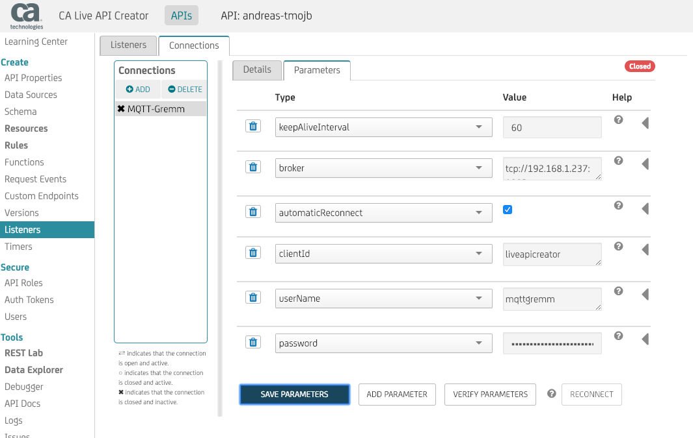
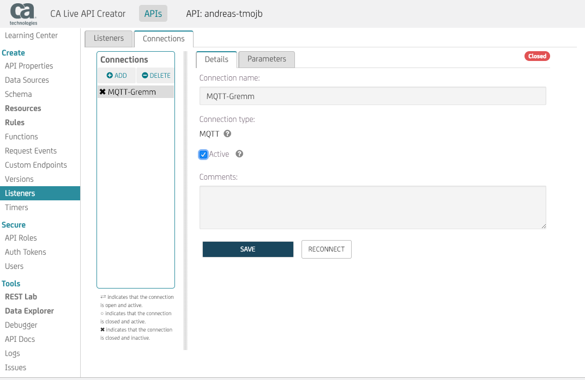
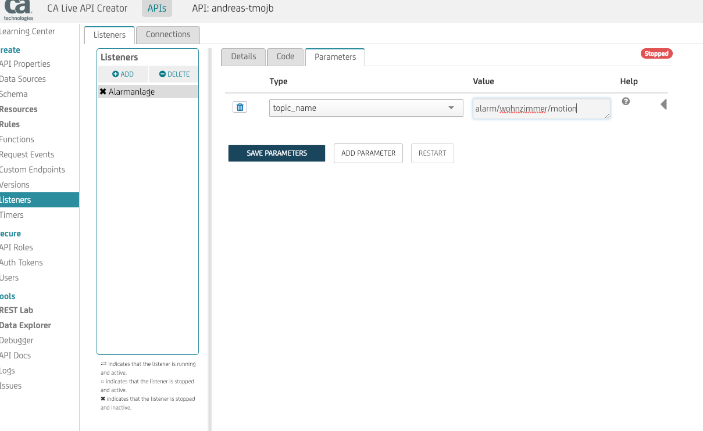
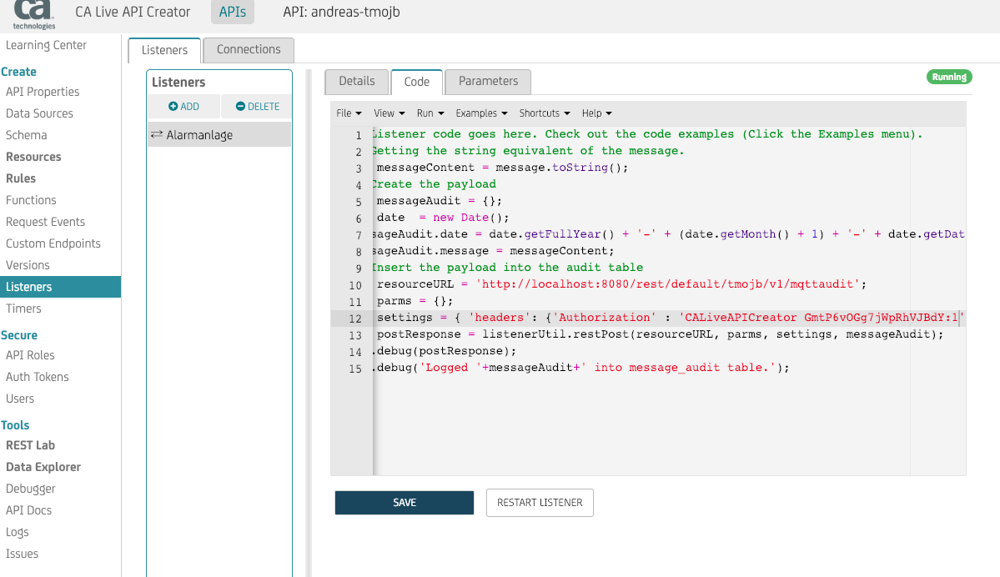
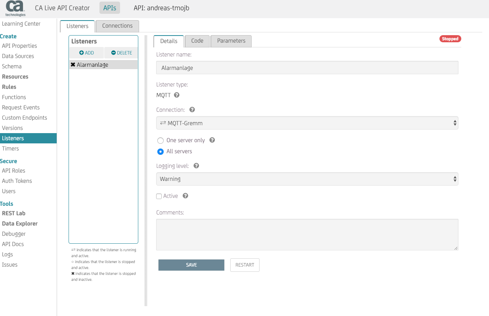
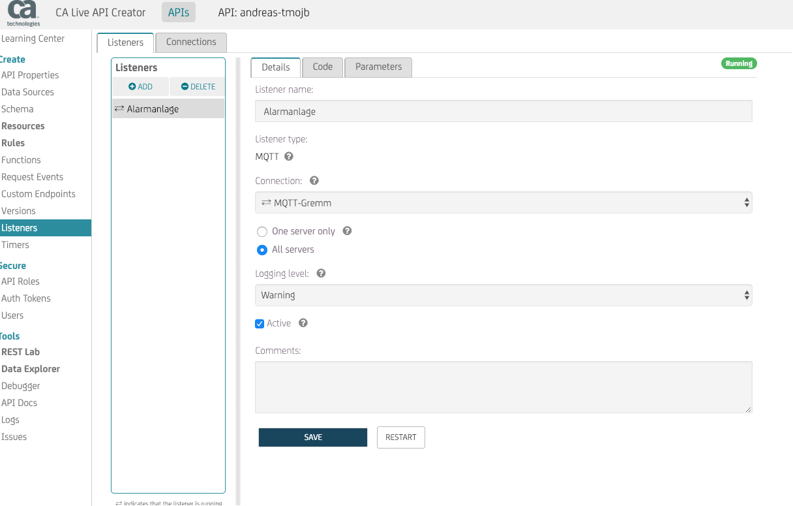

# MQTT Example
In diesem kleinen Beispiel wird die Anbindung des Layer7 Live API Creators an MQTT beschrieben.

Der MQTT Server läuft beispielsweise auf der IP Adresse 192.168.1.237, Port 1883 und ist mit einem Benutzernamen und Passwort gesichert.

In diesem Beispiel wird die Information des Topic **alarm/wohnzimmer/motion**, welches beim Einschalten der Alarmierung durch den Bewegungsmelder im Wohnzimmer auf *True*, bzw. beim Ausschalten auf *False* gesetzt wird, mit dem aktuellen Datum und Uhrzeit in die Tabelle [MQTT_Audit](db\_example.sql) geschrieben. Für die konkrete Anwendung ist hier ein Topic zu wählen der im vorhandenen MQTT-Umfeld auch tatsächlich genutzt wird. Meine verwendete Beispieldatenbank:

```
--
-- Datenbank: `andreas`
--
CREATE DATABASE IF NOT EXISTS `andreas` DEFAULT CHARACTER SET utf8mb4 COLLATE utf8mb4_0900_ai_ci;
USE `andreas`;


--
-- Tabellenstruktur für Tabelle `MQTT_Audit`
--

CREATE TABLE `MQTT_Audit` (
  `ID` int(11) NOT NULL,
  `date` datetime NOT NULL,
  `message` varchar(10) CHARACTER SET utf8mb4 COLLATE utf8mb4_0900_ai_ci NOT NULL
) ENGINE=InnoDB DEFAULT CHARSET=utf8mb4 COLLATE=utf8mb4_0900_ai_ci;

--
-- AUTO_INCREMENT für Tabelle `MQTT_Audit`
--
ALTER TABLE `MQTT_Audit`
  MODIFY `ID` int(11) NOT NULL AUTO_INCREMENT, AUTO_INCREMENT=6;
COMMIT;
```

Beispielhafte Rechte für den Benutzer *Andreas*:

```
# Rechte für `andreas`@`%`

GRANT USAGE ON *.* TO `andreas`@`%`;

GRANT ALL PRIVILEGES ON `andreas`.* TO `andreas`@`%`;

GRANT ALL PRIVILEGES ON `andreas\_%`.* TO `andreas`@`%`;
```


In unserem erzeugten API gehen wir auf den Menupunkt *Listeners* und fügen einen neuen Listener hinzu.
Im Add Listener Formular vergeben wir einen frei wählbaren Namen und wählen *MQTT* als Listener Typ.

Im Reiter Connection geben wir die MQTT Verbindungsparameter  und die MQTT Verbindungsdetails  an.

Im Reiter Listeners geben wir die MQTT Listenerparameter  und den Listener Code   
(Textbeispiel [hier](Listener_Code_Example.txt)) ein.

Im obigen Beispiel sind die Variablen *resourceURL* und *settings* an die konkreten Gegebenheiten anzupassen. Falls die Tabellenstruktur ine andere als im Beispiel angegeben ist, müssen auch 

Am Schluss vervollständigen wir noch die MQTT Listenerdetails 

Nach der Sicherung sind wir fertig und bekommen eine positive Rückmeldung: 


